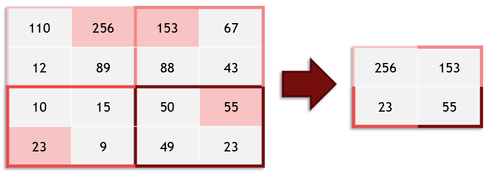
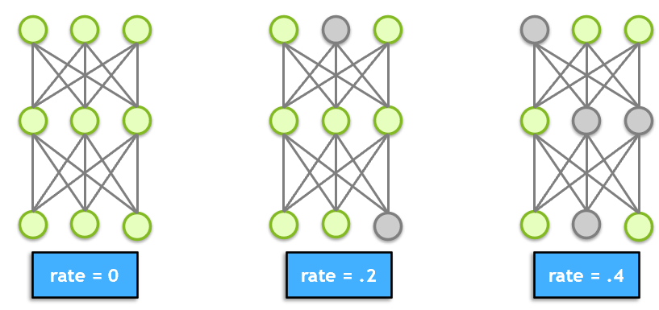

# Jupyter Notebook # 

"These days, many data scientists start their projects by borrowing model properties from a similar project. Assuming the problem is not totally unique, there's a great chance that people have created models that will perform well which are posted in online repositories like [TensorFlow Hub](https://www.tensorflow.org/hub) and the [NGC Catalog](https://ngc.nvidia.com/catalog/models). Today, we'll provide a model that will work well for this problem."

----
**Clear Memory**  
```py
import IPython
app = IPython.Application.instance()
app.kernel.do_shutdown(True)
```

----
The `input_shape` value specifies the shape of the incoming data which in our situation is a 1D array of 784 values: 
```py
model.add(Dense(units=512, activation='relu', input_shape=(784,)))
```
add a hidden layer
```py
model.add(Dense(units = 512, activation='relu'))
```
output layer, where `'softmax'` generates a probability distribution that sums to unity
```py
model.add(Dense(units = 10, activation='softmax'))
```
summarize model
```py
model.summary()
```
compile data and specify loss func
```py
model.compile(loss='categorical_crossentropy', metrics=['accuracy'])
```
train model
```py
model.fit(
    x_train, y_train, epochs=5, verbose=1, validation_data=(x_valid, y_valid)
)
```

----
----
## Model Layers ##
----
**Max Pooling:**  
Pooling is when you take values in window/kernel and run a simple computational process.  "Max Pooling" is taking the max value from the window.  
- Useful for large images --> smaller images
  - quicker to work with smaller data
  - cheaper to work with smaller data 



----
**Dropout:**  
- helps prevent overfitting
- Randomly shutoff neurons at user specified rate (ie -- unable to learn for that step of training)
- Is argued that `dropout` reflects ensemble learning.

